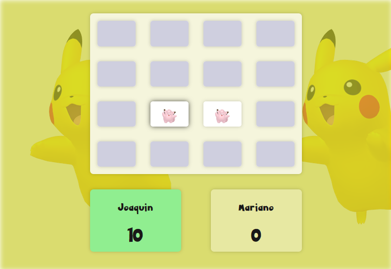
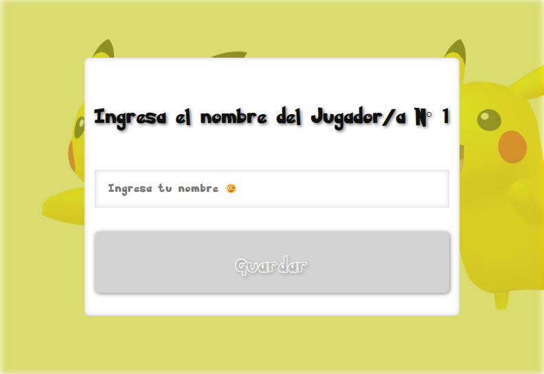

### memory-poke

> Proyecto de curso fullstack en apx

🎮 Es un juego de memoria utilizando las figuras de pokemon traidas desde la api publica, se juega de a dos, cada uno escribe su nombre y comienzan a jugar, suman puntos y al final se determina un ganador mostrando su nombre.

💡📚 ¿Que aprendí en este proyecto?

✅ Lógica funcional

✅ Fetching de datos

✅ Estilos para imagenes, diseño responsive 

